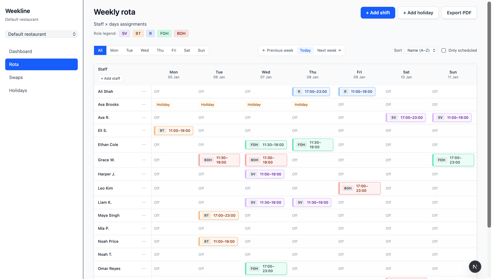
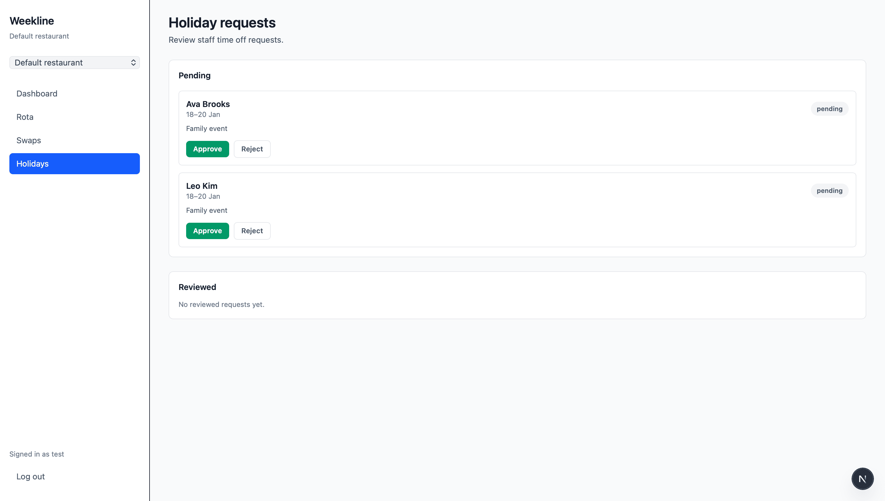
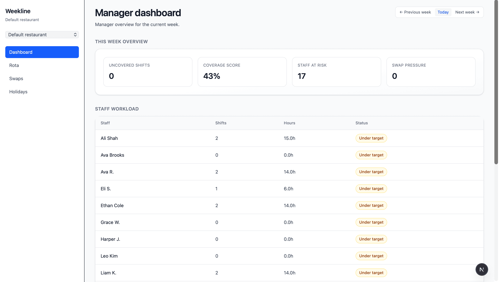
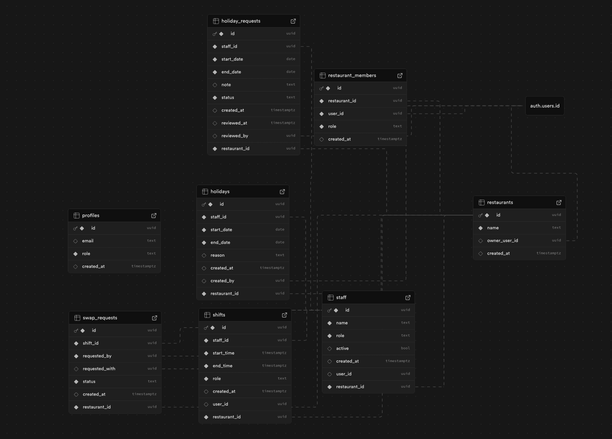
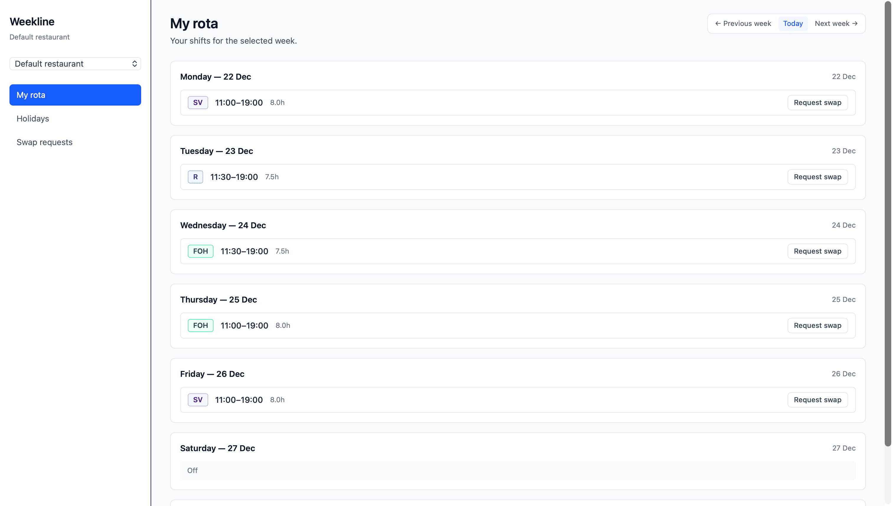

# Weekline

Restaurant rota and workforce management platform for hospitality teams.

---

## Overview

Weekline is a workforce scheduling platform designed for hospitality teams. The application replaces spreadsheet-based rota management with a role-based system where managers can create weekly schedules, manage staff availability, review holiday and shift swap requests, and export rotas, while staff can access their own schedules and submit requests.

Built with Next.js App Router and Supabase, the platform uses authentication, row-level security, and a multi-tenant restaurant membership system.

---

## Features

- Email/password authentication
- Multi-restaurant workspace support
- Weekly rota builder
- Drag-and-drop shift reassignment
- Holiday request workflow
- Shift swap approval workflow
- Staff workload and coverage tracking
- PDF rota export
- Role-based manager and staff views
- Responsive dashboard UI

---

## Screenshots

## Screenshots

### Weekly rota management

### Holiday approval workflow

### Manager dashboard

### Database schema

### Staff rota view

---

## Tech Stack

| Layer | Technology |
|---|---|
| Frontend | Next.js 16 + React 19 + TypeScript |
| Styling | Tailwind CSS 4 |
| Backend/Data | Supabase |
| Database | PostgreSQL |
| Authentication | Supabase Auth |
| Authorization | Supabase Row Level Security |
| PDF Export | jsPDF |

---

## Architecture

- Next.js App Router application
- Client-side Supabase data access
- Multi-tenant restaurant membership system
- Role-aware navigation and workflows
- Supabase Row Level Security policies for access control
- Context-based restaurant workspace switching

---

## Core Workflows

### Manager Workflow

- Build and manage weekly rotas
- Assign and edit shifts
- Review holiday requests
- Approve/reject swap requests
- Monitor staffing coverage

### Staff Workflow

- View weekly rota
- Submit holiday requests
- Request shift swaps
- View request statuses

---

## Local Development

bash npm install npm run dev 

---

## Future Improvements

- CI/CD pipeline
- Automated testing
- Calendar integrations
- Notifications
- Better analytics and reporting
- Mobile optimisations
